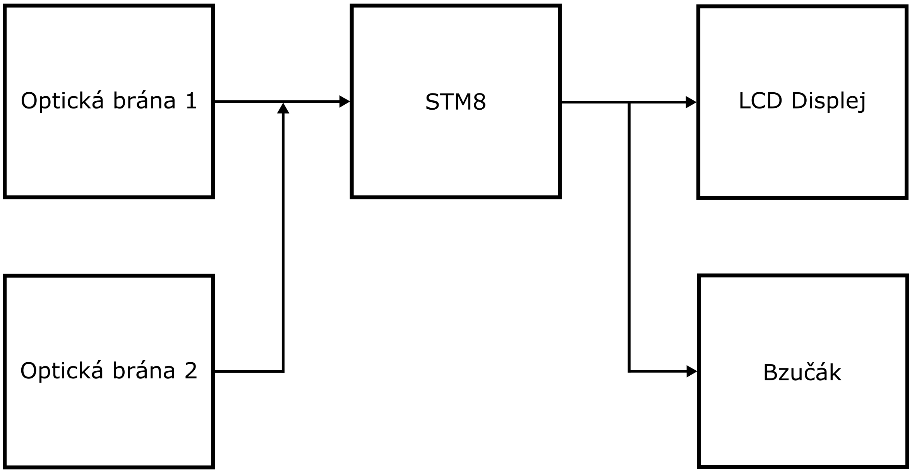
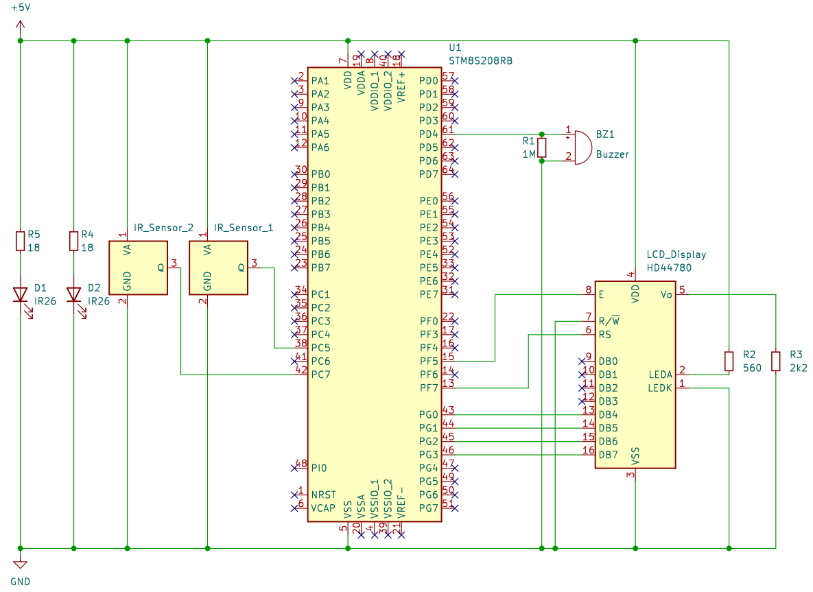

# Závěrečný projekt - Počítadlo průchodů
## Richard Gadas   3A

## Zadání:
1. Počítá, kolik lidí prošlo dovnitř a ven pomocí dvojice optických IR bran.
2. Při průchodu vydá akustický signál.
3. Stav počtu lidí zobrazen na LCD display.

## Blokové schéma:


## Schéma zapojení



## Vývojový diagram


## Stručný popis činnosti programu
Tento program slouží pro počítání průchodů, jejichž počet se zapisuje na LCD displej. Každý průchod je oznámen zvukovou signalizací přes piezoelektrický bzučák (rozdílné melodie pro oznámení vstupu a výstupu). Program myslí i na případ, kdy předmět projde jednou dvojicí senzorů, neprojde už druhou dvojicí, ale vrátí zpět stejnou cestou.


## Zdrojový kód
Odkaz na [git repositář](https://github.com/Pangas06/Projekt_MIT)

1. Načtení knihoven
```c
#include <stdbool.h>
#include <stm8s.h>
#include <stdio.h>
#include "main.h"
#include "milis.h"
#include <stm8_LCD.h>
#include "__assert__.h"
```
2. Definování a inicializace Portů, Pinů a milis()
```c
#define SENZOR1_PORT GPIOC
#define SENZOR1_PIN GPIO_PIN_7

#define SENZOR2_PORT GPIOC
#define SENZOR2_PIN GPIO_PIN_6

#define BTN_PORT GPIOE
#define BTN_PIN  GPIO_PIN_4

#define PZ_PORT GPIOD
#define PZ_PIN  GPIO_PIN_4

/*
1. PZ_DOWN     nastaví pin do úrovně High
2. PZ_UP       nastaví pin do úrovně Low
3. PZ_REVERSE  převrátí úroveň pinu
*/

#define PZ_DOWN     GPIO_WriteHigh(PZ_PORT, PZ_PIN)        
#define PZ_UP       GPIO_WriteLow(PZ_PORT, PZ_PIN)           
#define PZ_REVERSE  GPIO_WriteReverse(PZ_PORT, PZ_PIN)  

void init(void)
{
    CLK_HSIPrescalerConfig(CLK_PRESCALER_HSIDIV1);      // taktovani MCU na 16MHz
    GPIO_Init(LED_PORT, LED_PIN, GPIO_MODE_OUT_PP_LOW_SLOW);
    GPIO_Init(BTN_PORT, BTN_PIN, GPIO_MODE_IN_FL_NO_IT);
    GPIO_Init(SENZOR1_PORT, SENZOR1_PIN, GPIO_MODE_IN_FL_NO_IT);
    GPIO_Init(SENZOR2_PORT, SENZOR2_PIN, GPIO_MODE_IN_FL_NO_IT);
    GPIO_Init(PZ_PORT, PZ_PIN, GPIO_MODE_OUT_PP_LOW_SLOW);

    init_milis();
}
```
3. Funkce pro akustický signál pro vstup
```c
void zvuk_vstup(void){
	
    uint32_t lastTime = 0;
    uint16_t UP=1;
    uint16_t DOWN=0;
    uint16_t zvuk_stav = 1;
    uint32_t time = 0;

    time = milis();
    lastTime = milis();
    while(1){                              // Při zavolání této funkce se spustí první cyklus while, který jednou za milisekundu přepne stav pinu, na kterém je připojený piezoelektrický bzučák, a tím generuje tón s frekvencí 500 Hz.

        if (UP == zvuk_stav){     
            PZ_UP;
            if (milis() - lastTime > 1) { //Po 1 milisekundě se přepne stav Pinu z High na Low, protože zvuk_stav se nastaví na 0
                    lastTime = milis();   //nastavení lastTime na čas milis()
                    zvuk_stav = 0;
                }
        }else if (DOWN == zvuk_stav){  
            PZ_DOWN;
            if (milis() - lastTime > 1) { //Po 1 milisekundě se přepne stav Pinu z High na Low, protože zvuk_stav se nastaví na 1
                    lastTime = milis();   //nastavení lastTime na čas milis()
                    zvuk_stav = 1;
                }
        }
        if(milis() - time > 50){         //Po 50 milisekundách se tento cyklus přeruší.
            PZ_UP;
            break;                       //přerušení cyklu
        }
    }

    time = milis();
    while(1){                     //Druhý cyklus while přepíná stav pinu s vyšší frekvencí -> vyšší tón.
        PZ_REVERSE;
        if(milis() - time > 100){ //Po 100 milisekundách se přeruší. Takto vznikne melodie pro označení vstupu.
            PZ_UP;
            break;                //přerušení cyklu
        }
    }
}
```

4. Funkce pro akustický signál pro výstup
   Tato funkce je obdoba předešlé funkce, akorát začíná vyšším tónem s vyšší frekvencí po dobu 50 milisekund a končí tónem s nižší frekvencí po dobu 100 milisekund. Takto vznikne melodie pro označení výstupu.
```c
void zvuk_vystup(void){
	
    uint32_t lastTime = 0;
    uint16_t UP=1;
    uint16_t DOWN=0;
    uint16_t zvuk_stav = 1;
    uint32_t time = 0;

    time = milis();
    while(1){
        PZ_REVERSE;
        if(milis() - time > 50){
            PZ_UP;
            break;
        }
    }

    time = milis();
    lastTime = milis();

    while(1){
        if (UP == zvuk_stav){
            PZ_UP;
            if (milis() - lastTime > 1) {
                    lastTime = milis();
                    zvuk_stav = 0;
                }
        }else if (DOWN == zvuk_stav){
            PZ_DOWN;
            if (milis() - lastTime > 1) {
                    lastTime = milis();
                    zvuk_stav = 1;
                }
        }
        if(milis() - time > 100){
            PZ_UP;
            break;
        }
    }
}
```
5. Definování proměnných a zavolání funkce init().
```c
int main(void){
    init();
    uint16_t mezivstup  = 0;
    uint16_t mezivystup  = 0;
    uint16_t senzorstav1 = 0;
    uint16_t senzorposledni1 = 0;
    uint16_t senzorstav2 = 0;
    uint16_t senzorposledni2 = 0;
    
    uint16_t vstup_ted = 0;
    uint16_t vstup_pred = 0;
    uint16_t vystup_ted = 0;
    uint16_t vystup_pred = 0;

    char text[20];
    char text2[20];
```

6. Inicializace LCD displeje a první zaslání dat pro zobrazení.
```c
  lcd_init();
  lcd_gotoxy(0,0);                                    //určení souřadnice, odkud začít psát na displej
  sprintf(text,"vstupy  =   %u",(uint16_t)vstup_ted); //převede hodnotu proměnné vstup_ted na znaky, které skládá do řetězce a ten se zapíše do pole text
  lcd_puts(text);                                     //funkce, která vytiskne pole text na displej

  lcd_gotoxy(0,1);
  sprintf(text2,"vystupy =   %u",(uint16_t)vystup_ted);
  lcd_puts(text2);
```
7. Hlavní cyklus while.
```c
  while(1){
        senzorstav1 = GPIO_ReadInputPin(SENZOR1_PORT, SENZOR1_PIN); //přečtení a uložení stavu Pinu, na kterém je připojen senzor1, do proměnné senzorstav1
        senzorstav2 = GPIO_ReadInputPin(SENZOR2_PORT, SENZOR2_PIN); //přečtení a uložení stavu Pinu, na kterém je připojen senzor2, do proměnné senzorstav2

        if(senzorstav1 == 0 && senzorposledni1 == 1){               //první dvojice senzorů zareaguje na překážku jen tehdy, když se mezi vysílačem a přijímačem přeruší spojení
            mezivstup += 1;                                         // proměnná mezivstup se zvýší o 1
        }
        if(senzorstav2 == 0 && senzorposledni2 == 1 && mezivstup == 1){ //když druhá dvojice senzorů zareaguje na překážku a mezivstup se bude rovnat 1, tak to znamená že předmět prošel skrz první a poté druhou dvojicí snímačů -> vstup
            vstup_ted += 1;
        }

        if(senzorstav2 == 0 && senzorposledni2 == 1){               //první dvojice senzorů zareaguje na překážku jen tehdy, když se mezi vysílačem a přijímačem přeruší spojení
            mezivystup += 1;                                        // proměnná mezivýstup se zvýší o 1
        }
        if(senzorstav1 == 0 && senzorposledni1 == 1 && mezivystup == 1){ //když první dvojice senzorů zareaguje na překážku a mezivýstup se bude rovnat 1, tak to znamená že předmět prošel skrz druhou a poté první dvojici snímačů -> výstup
            vystup_ted += 1;
        }

        senzorposledni1 = senzorstav1;        //uložení nynějšího stavu první dvojice senzorů jako předchozí stav
        senzorposledni2 = senzorstav2;        //uložení nynějšího stavu druhé dvojice senzorů jako předchozí stav
        
        if(mezivstup==2){
            mezivstup = 0;                    // pokud by se mezivstup rovnal 2, tak to znamená, že objekt prošel jen první dvojicí senzorů, poté se obrátil a opět prošel první dvojicí, což není vstup a mezivstup se musí vynulovat
        }else if(mezivystup==2){              // pokud by se mezivýstup rovnal 2, tak to znamená, že objekt prošel jen druhou dvojicí senzorů, poté se obrátil a opět prošel druhou dvojicí, což není výstup a mezivýstup se musí vynulovat
            mezivystup = 0;
        }
        
        if(vstup_ted > vstup_pred){          //pokud se zvýší nynější hodnota vstupu oproti předešlé, tak došlo k provedení vstupu
            mezivstup = 0;                   //vynulování mezivstupu
            mezivystup = 0;                  //vynulování mezivýstupu
            vstup_pred = vstup_ted;          //uložení nynějšího stavu vstupu jako předchozí počet vstupů
            lcd_gotoxy(0,0);                 //napsání na displej
            sprintf(text,"vstupy  =   %u",(uint16_t)vstup_ted);
            lcd_puts(text);
            zvuk_vstup();                    //melodie vstupu
        }else if(vystup_ted > vystup_pred){  //pokud se zvýší nynější hodnota výstupu oproti předešlé, tak došlo k provedení výstupu
            mezivystup = 0;                  //vynulování mezivstupu
            mezivstup = 0;                   //vynulování mezivýstupu
            vystup_pred = vystup_ted;        //uložení nynějšího stavu výstupu jako předchozí počet výstupů
            lcd_gotoxy(0,1);                 //napsání na displej
            sprintf(text2,"vystupy =   %u",(uint16_t)vystup_ted);
            lcd_puts(text2);
            zvuk_vystup();                   //melodie výstupu
        }
    }
}
```

## Závěr:
Tato práce byla mým prvním projektem na mikrokontroléru STM8. Programování probíhalo v programovacím prostředí Visual Studio Code. Tímto projektem jsem se naučil číst data z optických snímačů, práci s LCD displejem a zlepšil dovednosti na STM8. Na projektu jsem strávil 50 hodin.

Další možné vylepší toho projektu jsou:
1. Přidání bezdrátové komunikace pro přenos dat na vzdálené zařízení.
2. Změna napájení na 9V baterii a přidání indikace o stavu nabití.
3. Rozšíření o monitorování více průchodů.


